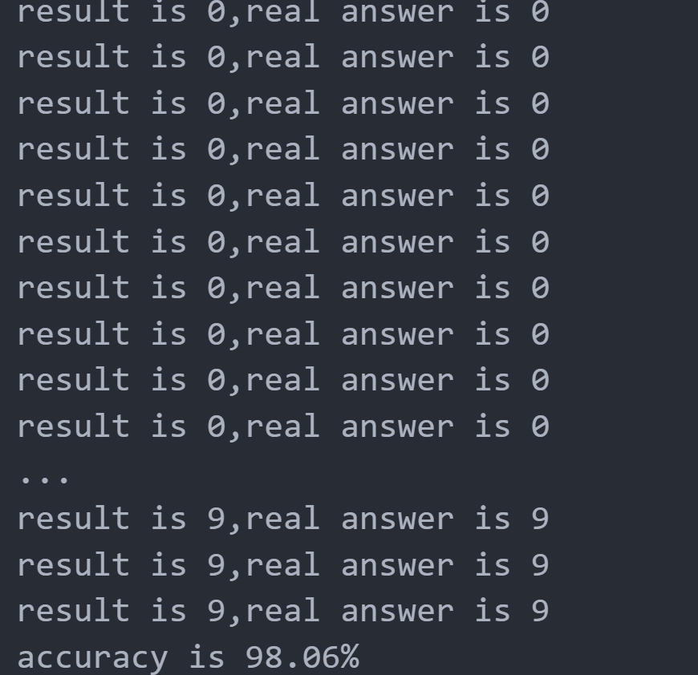
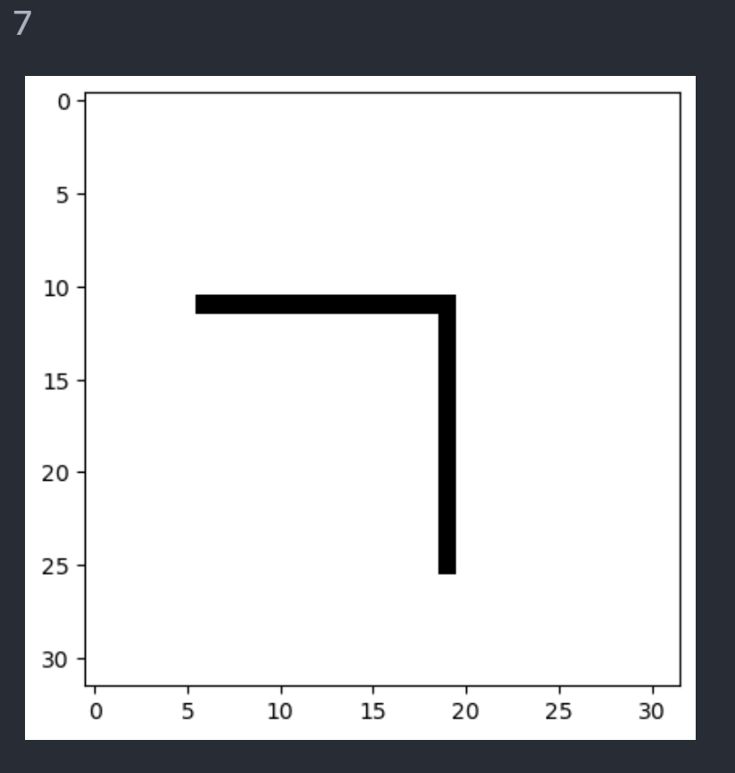
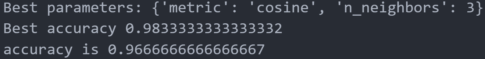

# 基于Knn算法的识别(基于欧氏距离的Knn实现)

## 使用欧氏距离和FOR循环，实现KNN算法，利用所提供的手写数字识别数据集对KNN进行训练

```python
import numpy as np
from os import listdir
def loadDataSet():
    #读取训练集
    print("1 loading trainSet")
    trainFileList = listdir("HWdigits/trainSet")
    #将目录下所有的文件名称存为一个列表
    trainNum = len(trainFileList)#目录下的文件个数就是列表的长度

    trainX=np.zeros((trainNum,32*32))#创建一个行数为文件个数的，列数为图片大小的矩阵
    trainY=[]
    for i in range(trainNum):#i是子文件的索引
        trainFile = trainFileList[i]#文件的名字是列表中的每个元素，取第i个元素
        trainX[i,:] = img2vector("HWdigits/trainSet/%s" % trainFile,32,32)
        #定义的函数将子文件读取，定义高和宽为32
        label= int(trainFile.split("_")[0])#文件的第一位为类型，读取作为类型标签
        trainY.append(label)#把每一行的行标变为这个文件的类型标签

    #读取测试集
    print("2 loading testSet")
    testFileList = listdir("HWdigits/testSet")
    #将目录下所有的文件名称存为一个列表
    testNum = len(testFileList)#目录下的文件个数就是列表的长度

    testX=np.zeros((testNum,32*32))#创建一个行数为文件个数的，列数为图片大小的矩阵
    testY=[]
    for i in range(testNum):#i是子文件的索引
        testFile = testFileList[i]#文件的名字是列表中的每个元素，取第i个元素
        testX[i,:] = img2vector("HWdigits/testSet/%s" % testFile,32,32)
        #定义的函数将子文件读取，定义高和宽为32
        label= int(testFile.split("_")[0])#文件的第一位为类型，读取作为类型标签
        testY.append(label)#把每一行的行标变为这个文件的类型标签
    return trainX,trainY,testX,testY

def img2vector(filename,h,w):#将文件中的图片数据转换为列表
    imgVector = np.zeros((1,h*w))#把二维数组拉平为一维数组
    fileIn = open(filename)#打开对应的文件
    for row in range(h):
        lineStr = fileIn.readline()#按行读取文件
        for col in range(w):
            imgVector[0,row*32+col]=int(lineStr[col])#把每一列的数字都读出来然后存在矩阵的对应位置
    return imgVector#返回一维数组

def myKNN(testDigit,trainX,trainY,k):
    numSamples = trainX.shape[0]#获取训练样本的数量
    # 计算欧氏距离
    diff=[]
    for x in range(numSamples):
        diff.append(testDigit-trainX[x])#每个个体的差别
    diff=np.array(diff)#转为数组

    #对差求平方和，然后取平均值
    squaredDiff = diff**2
    squaredDist = np.sum(squaredDiff,axis=1)
    distance=squaredDist**0.5

    #按距离排序
    sortedDistIndices=np.argsort(distance)
    classCount={}
    for i in range(k):
        #按顺序读标签
        # voteLabel 是第 i 个最近邻的样本的标签 
        #sortedDistIndices是这个对应标签的位置
        voteLabel = trainY[sortedDistIndices[i]]

        #计算标签次数
        # 如果 voteLabel 在 classCount 中不存在，则将其计数初始化为0，然后加1  
        # 如果 voteLabel 已经存在，则直接在其计数上加1  
        classCount[voteLabel]=classCount.get(voteLabel,0)+1

    #查找出现最多次数的类别，作为分类结果
    maxCount=0
    for key,value in classCount.items():
        if value>maxCount:
            maxCount = value
            maxLabel = key
    return maxLabel
    
train_x,train_y,test_x,test_y=loadDataSet()#将训练集测试集处理好存储好
numTestSamples=test_x.shape[0]#返回样本的个数
matchCount=0


for i in range(numTestSamples):
    predict=myKNN(test_x[i],train_x,train_y,3)#预测样本的正确度
    print("result is {:d},real answer is {:d}".format(predict,test_y[i]))
    #打印预测和正确值
    if predict == test_y[i]:
        matchCount+=1#如果预测正确就正确计数加一
accuracy=float(matchCount)/numTestSamples#正确率是正确的计数值除以总数
print("accuracy is {:.2f}%".format(accuracy*100))#输出准确率
```

结果如下



---

## 手写字体的读入、规范和识别

```python
from PIL import Image
import numpy as np
from matplotlib import pyplot as plt

def load_image(file):
    im = Image.open(file).convert("1")#读入手写文字，改变为二值化的矩阵
    im = im.resize((32,32))#改变矩阵大小为32*32
    plt.imshow(im)#展示矩阵内容打印到屏幕上
    im=np.array(im).reshape(32*32)#改变矩阵的大小
    im = im / 255.0#把矩阵内容归一化
    return im#返回im的值


data=load_image(r"7.png")#读入图片传递给自定义的函数 读出处理好的图片
label=myKNN(data,train_x,train_y,5)#将矩阵传递给自定义的knn算法，返回一个识别值
print(label)#输出识别的结果
```

结果如下



---

## 对鸢尾花数据集进行训练和预测

```python
from sklearn.model_selection import GridSearchCV
from sklearn.datasets import load_iris
from sklearn.neighbors import KNeighborsClassifier
from sklearn.metrics import accuracy_score
from sklearn.model_selection import train_test_split
#导入所需要的库
knn = KNeighborsClassifier()#定义knn分类器

iris = load_iris()#读取鸢尾花数据集
X = iris.data#数据集中的数据
y=iris.target#数据集中数据的标签

x_train,x_test,y_train,y_test=train_test_split(X,y,test_size=0.2,random_state=42)
#将数据分为测试集和训练集

param_grid={'n_neighbors':[1,3,5,7,9],'metric':['euclidean','manhattan','cosine']}
#创建选择器，给分类器选择
grid_search=GridSearchCV(knn,param_grid,cv=5) #使用搜索算法找出最拟合的结果
grid_search.fit(x_train,y_train)#拟合结果

print("Best parameters:",grid_search.best_params_)#输出最好的结果
print("Best accuracy",grid_search.best_score_)#输出最好的准确率

y_pred=grid_search.predict(x_test)#使用最佳的模型进行预测

accuracy=accuracy_score(y_test,y_pred)#判断准确率
print("accuracy is",accuracy)#输出准确率
```

结果如下



---
