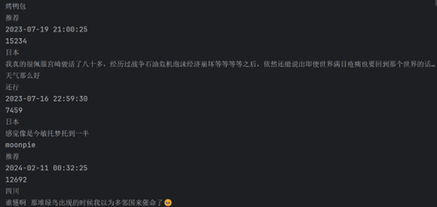
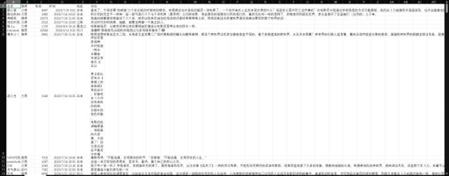

# 爬虫和词云

写爬虫代码的基本步骤：

1.发送请求，确定URL地址，然后对其发送请求

2.获取数据，获取服务器返回的响应数据内容

3.数据解析，提取想要的内容

4.保存数据

5.多页数据爬取

---

## 爬取豆瓣的top250电影数据

```python
import requests
#第一步，发送请求，确定URL地址，然后对其发送请求
#确定要爬取的URL地址
url='https://movie.douban.com/top250'

#User-Agent 浏览器的基本标识(基本信息) headers请求头:主要是把python代码进行伪装
#随机选取一个数据报的User-Agent复制即可
headers={
    'User-Agent':'Mozilla/5.0 (Windows NT 10.0; Win64; x64) AppleWebKit/537.36 (KHTML, like Gecko) Chrome/123.0.0.0 Safari/537.36'
    }

response=requests.get(url=url,headers=headers)

#第二步，获取数据，获取服务器返回的响应数据内容
#获取网页的文本数据，是字符串类型
#print(response.text)

#第三步：数据解析，提取想要的内容
#可以用来解析数据的方法：re正则表达式/xpath/css选择器

#Xpath方式比较简单，大家可以自行学习
#以下为：parsel解析模块里面css选择器
import parsel

#把获取到的html字符串数据类型进行转换
selector = parsel.Selector(response.text)#selector是一个对象

#先取得所有的li标签的信息，从上往下
#这一页的25个数据，即这一页所有的li标签，返回一个列表，其中每个元素都是selector的对象
lis=selector.css('.grid_view li')
for li in lis:
    title =li.css('.info .hd span.title:nth-child(1)::text').get()#电影名字
    print(title)
    movie_info = li.css('.bd p:nth-child(1)::text').getall()#电影的信息,试一下get getall的区别
  
    actor = movie_info[0].strip()#getall返回一个列表，strip去除字符串两端的空格
    print(actor)
    break
```

运行结果如下：


---

## 爬虫爬取对应电影的数据 包括名字 推荐 有用等数据

```python
import requests
import parsel
import csv
f = open('datas.csv',mode='a',encoding='utf-8-sig',newline='')
csv_writer=csv.DictWriter(f,fieldnames=[
    "名字",
    "推荐",
    "有用",
    "时间",
    "地区",
    "评论",
])#创建写csv的方法，创建分类方式
csv_writer.writeheader()#将分类方式写入表头

movie_id=26925611 #你想活出怎么样的人生  通过使用movieid来将增加程序的可修改性

for page in range(0, 200, 20):#只采集十页内容 每一页的start增加20
    url = f'https://movie.douban.com/subject/{movie_id}/comments?start={page}&limit=20&status=P&sort=new_score'
    headers={
    'User-Agent':'Mozilla/5.0 (Windows NT 10.0; Win64; x64) AppleWebKit/537.36 (KHTML, like Gecko) Chrome/122.0.0.0 Safari/537.36 Edg/122.0.0.0'
    }#模拟用户使用设备
    response=requests.get(url=url,headers=headers)#获得网页内容
    #print(response.text)
    selector = parsel.Selector(response.text)#创建一个selector对象,向其传入response.text参数
    lis=selector.css('div.comment-item')#将selector对象的指针指向“div类下comment-item”
    for li in lis:#用循环遍历这个目录下的代码
        name=li.css('.comment-info a::text').get()
        #print(name)
        rating=li.css('.rating::attr(title)').get()
        #print(rating)
        date=li.css('.comment-time::attr(title)').get()
        #print(date)
        votes=li.css('.vote-count::text').get()
        #print(votes)
        area=li.css('.comment-location::text').get()
        #print(area)
        short=li.css('.short::text').get()
        #print(short)
        dit={
            "名字":name,
            "推荐":rating,
            "有用":votes,
            "时间":date,
            "地区":area,
            "评论":short
        }#写一个字典，作为输入数据写入csv
        csv_writer.writerow(dit)#写入csv文件

```

运行结果如下：





---

## 生成词云展示评论中某个词的出现频率

```python
from wordcloud import WordCloud
import matplotlib.pyplot as plt
from imageio.v3 import imread
import jieba

stopwd=[]
#创建了一个停用词列表，列表内容是从'stopwords_hit.txt'里面拿的，这个文件是哈工大的停用词库
#这个停用词库还是有很多想要删除但是还存在的内容，因此做了补充
with open('stopwords_hit.txt',"r",encoding="utf-8") as stop:
    for line in stop:
        line=line.replace("\n","")
        stopwd.append(line)
        #遍历整个文件，去掉换行，添加成字符串保存在stopwd
bg_pic = imread('heart.png')#读入样例图片
text = open('datas.csv','r',encoding="utf-8-sig").read()#读入评论文本（已经处理只剩下评论）
text1 = jieba.cut(text,cut_all=False)#jieba分词，采用搜索引擎分词，分词不重复
text1=list(text1)#jieba分词结果存在list中
wdcd=WordCloud(width=1600,height=1600,mask=bg_pic,background_color='white',scale=20,stopwords=stopwd,font_path='SimHei.ttf')
#定义词云参数 scale是词云的缩放程度 越大越清晰，wid height设置大小 mask设置模板 背景颜色 停用词 字体
#在生成词云的时候需要指定字体 要不然会乱码，加上参数font_path='SimHei.ttf'
text2=" ".join(text1)#将所有的分完词的评论合成一个大的字符串，以空格分开，词云默认以空格分割
wdcd=wdcd.generate(text2)#将text2按上面的格式生成词云
plt.imshow(wdcd)#绘制词云图到幕布上
plt.axis('off')#关闭plt坐标轴
plt.show()#展示幕布
wdcd.to_file('pic.jpg')#将词云图保存为pic.jpg文件

#特别注意：巨坑！文件名字不能是wordcolud，是的话就会报错！！！因为调用的函数是wordcloud这个名字，
#文件名称相同的话会导致变成调用这个文件
```

运行结果如图：


